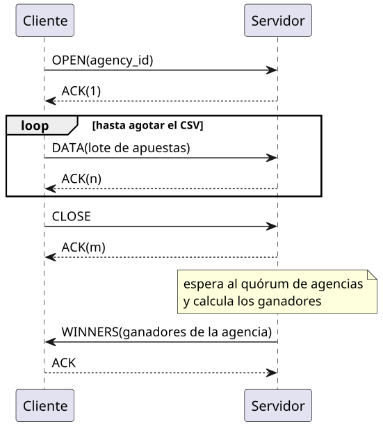

# Informe - TP Nivelador: Docker, Comunicaciones y Concurrencia


| Alumno              | Padron | email            |
|---------------------|--------|------------------|
| Franco Daniel Capra | 99642  | fcapra@fi.uba.ar |


## Comentarios y Fallas encontradas

El protocolo implementado, o la lectura de los archivos, genera
que falle el test de memoria.

Se buscó solucionar eso sin éxito.

Analizándolo con un LLM, el mismo atribuye el error a un tema relacionado con el kernel y con cómo
carga el archivo a medida que se va leyendo.

La implementación fue cambiando a lo largo del desarrollo, pero en ningún caso se tuvo éxito para
hacer pasar el test.

En estas iteraciones, se agregó un buffer para intentar hacer la menor cantidad de asignaciones de memoria
al convertir las apuestas a bytes.

También se cambió la forma en que se lee el archivo (siempre línea por línea), pero pasando de usar `Text()` a
usar `Bytes()` en el `Scanner` de `bufio`. Esto también sin éxito alguno.

> [!NOTE]
>  *OBS:* Profundizando en el error del test llegue a la causa y solucion pero al no ser 100% de mi autoria dicha solucion, 
> sera compartida por email con la catedra para evitar confusiones.

## Supuestos

1. El servidor extrae el número ganador una unica vez. Solo publica los ganadores cuando un **quórum de agencias**  
finalizó el envio de las mismas, de modo que el sorteo se calcula sobre el total de apuestas presentes
hasta ese momento simulando un cierre de ventana para todas las agencias. Las apuestas que lleguen posteriores al
cierre no seran consideradas para el sorteo.

2. Se asume que no ingresaran mensajes maliciosos al sistema.

3. Se asume que el csv proporcionado es correcto y contiene todos los campos necesarios.

4. Ante cualquier error de comunicación, el cliente aborta y termina la ejecución. El servidor ignora al cliente que
falló y sigue atendiendo a los demás.

## Arquitectura general

El sistema está compuesto por **5 clientes** (Go, uno por agencia) y **1 servidor** (Python) que se comunican 
por **TCP** usando un protocolo binario propio. 
Cada cliente lee apuestas de un CSV linea a linea, las envía en lotes (batching), y al final recibe del servidor la lista de 
ganadores de su agencia para escribirlos en un archivo.


A nivel de codigo, se busco en GO implementar contra
interfaces y no contra structs concretos.

En Pyhon, se intento aplicar algo similar y por eso se utilizo la libreria `abc` para definir clases abstractas a
modo de interfaces.

## Protocolo de comunicación

### Estructura general
Protocolo binario **big-endian**, con *batching* por longitud:

```
[ payload_length: 4 bytes ][ message_id: 4 bytes ][ type: 1 byte ][ data ]
```

### Tipos de mensajes
Tipos de mensaje (`services/client/src/protocol/common.go`, espejados en `services/server/src/protocol/messages.py`):

| Type | Nombre  | Contenido                          |
|------|---------|------------------------------------|
| 0x00 | OPEN    | agency_id (u32)                    |
| 0x01 | DATA    | cantidad (u32) + lista de apuestas |
| 0x02 | CLOSE   | —                                  |
| 0x03 | WINNERS | lista de apuestas ganadoras        |
| 0x04 | ACK     | —                                  |

Cada apuesta se codifica como: nombre y apellido (longitud u8 + un byte por caracter), documento (u32), fecha de nacimiento 
(u32 en formato AAAAMMDD) y número apostado (u32).

### Tamaño en bytes de cada mensaje

Todos los mensajes comparten el encabezado del batch; la diferencia está en los datos:

### Encabezado de batch — total: **9 bytes**
| Campo            | Tipo | Bytes       | Máx. representable      |
|------------------|------|-------------|-------------------------|
| `payload_length` | u32  | 4 (siempre) | 4.294.967.295 (4 GiB)    |
| `message_id`     | u32  | 4 (siempre) | 4.294.967.295 mesajes   |
| `type`           | u8   | 1 (siempre) | 255 (se usan 0x00–0x04) |

*Aclaración:* **payload_length** podria reducirse a 2 bytes (u16) si se garantiza que ningún lote supere los 65.535 bytes.
Ante el desconocimiento de esto, se optó por 4 bytes (u32).

### Tamaño de cada tipo de mensaje
**OPEN** — total: **13 bytes**

| Parámetro             | Tipo | Bytes | Máx. representable     |
|-----------------------|------|-------|------------------------|
| encabezado (3 campos) | —    | 9     | —                      |
| `agency_id`           | u32  | 4     | 4.294.967.295 agencias |

**CLOSE** y **ACK** — total: **9 bytes** (solo encabezado, sin datos)

**DATA** y **WINNERS** — total: **11 + Σ(14 + len(nombre) + len(apellido))** por apuesta

| Parámetro                      | Tipo                   | Bytes   | Máx. representable                  |
|--------------------------------|------------------------|---------|-------------------------------------|
| encabezado (3 campos)          | —                      | 9       | —                                   |
| `cantidad` de apuestas         | u16                    | 2       | 65.535 apuestas por mensaje         |
| por cada apuesta: `nombre`     | u8 (longitud) + string | 1 + len | 255 caracteres (256 bytes)          |
| por cada apuesta: `apellido`   | u8 (longitud) + string | 1 + len | 255 caracteres (256 bytes)          |
| por cada apuesta: `documento`  | u32                    | 4       | 4.294.967.295                       || por cada apuesta: `nacimiento` | u32 (AAAAMMDD)         | 4       | 9999-12-31 (máx. del formato fecha) |
| por cada apuesta: `número`     | u32                    | 4       | 4.294.967.295                       |

Ejemplo: un lote DATA de 10 apuestas con nombres de ~8 y apellido de ~10 caracteres ocupa 11 + 10 × (14 + 8 + 10) = **331 bytes**.

### Semántica stop-and-wait con ACKs identificados

El protocolo es **sincrónico con acuse de recibo**: cada mensaje del cliente lleva un `message_id` creciente y el 
receptor responde un ACK con ese mismo id. El emisor bloquea hasta recibir el ACK esperado. 

El cliente también hace ACK del mensaje WINNERS, de modo que 
**toda transmisión tiene confirmación en ambos sentidos**.

### Diagrama de mensajes

<figure align="center">
    
    <figcaption> Diagrama 1: Mensajes enviados entre cliente y servidor </figcaption>
</figure>


## Sincronización de la ejecución concurrente

- **Un hilo por conexión**: el servidor (`server.py`, subclase de `threading.Thread`) acepta conexiones en un bucle y 
lanza un `ServerClient` (thread) por cada cliente.

- **`ClientRegistry`**: lista protegida por un `threading.Lock` para registrar, limpiar hilos terminados y cerrar/join 
de forma ordenada al apagado del servidor.

- **`LotteryMonitor` — el punto de sincronización central**: usa una `threading.Condition` para:
  
  - **Publicación única del sorteo**: el primer hilo que detecta `agencias_cerradas >= quorum` calcula los ganadores 
    sobre el total de apuestas y los guarda en `_winners`; los demás hilos esperan con `cond.wait()` hasta que estén 
    disponibles (`notify_all`). Esto garantiza que todas las agencias reciben resultados calculados sobre el mismo 
    universo de apuestas.
  
  - **Filtrado por agencia**: cada hilo retorna solo los ganadores de su `agency_id`.
  
  - **Corte limpio ante shutdown**: `abort()` hace que todos los hilos bloqueados en `wait()` despierten 
    y finalicen en vez de quedar colgados.

- **Apagado graceful**: ambos procesos manejan señales SIGTERM; el servidor cierra el socket de escucha, 
  aborta el monitor y joinea a los clientes; el cliente cierra protocolo y archivos. Para manejar estos estados y cierres, 
  se utilizan `atomic.Bool` en Go y `threading.Event` en Python.
